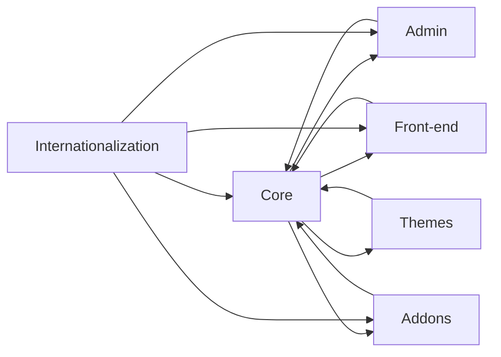

# Shuup Shoppe Architecture Analysis

This analysis examines the architecture of the Shuup Shoppe repository based on the provided code snippets.  The system appears to be a multi-tenant e-commerce platform with a modular design, supporting extensibility through plugins and a robust internationalization strategy.

## Overall System Architecture and Design Patterns

Shuup Shoppe employs a layered architecture, incorporating several design patterns:

* **Layered Architecture:** The system is structured into distinct layers: presentation (front-end, admin), application (business logic, services), and data (database).  This promotes separation of concerns and maintainability.

* **Plugin Architecture:** The extensive use of configuration files like `.tx/config` and the presence of numerous modules (e.g., `shuup/addons`, `shuup/campaigns`, `shuup/core`) suggests a plugin architecture.  This allows for extensibility and customization without modifying the core codebase.  The `provides` system mentioned in several changelog entries further reinforces this.

* **Microservices (Potential):** While not explicitly stated, the modularity hints at a potential microservices architecture, where individual modules could be deployed and scaled independently.  However, the provided code doesn't definitively confirm this.

* **Model-View-Controller (MVC):**  The Django framework is used, which inherently follows the MVC pattern.  The `admin` directory suggests a robust admin panel built on Django's admin framework.

* **Repository Pattern (Potential):** The data access layer likely utilizes a repository pattern, abstracting database interactions.  This is inferred from the mention of data importers and the focus on data integrity.

## Component Relationships and Dependencies

The system's components interact as follows:

* **Core (`shuup/core`):** Forms the foundation, providing core functionalities like product management, order processing, and user accounts.  Most other modules depend on it.

* **Admin (`shuup/admin`):**  Provides the administrative interface for managing products, orders, users, and other aspects of the shop.  It relies heavily on the core module and likely uses Django's admin framework.

* **Front-end (`shuup/front`):**  Handles the customer-facing aspects of the shop, including product browsing, shopping cart, and checkout.  It depends on the core module for data retrieval and business logic.

* **Themes (`shuup/themes`):** Allow for customization of the front-end appearance.

* **Plugins/Addons (`shuup/addons`, other modules):** Extend the core functionality, adding features like discounts, campaigns, and reporting.  They interact with the core and potentially other modules through well-defined interfaces.

* **Internationalization (`tx/config`):**  The `.tx/config` file indicates a sophisticated internationalization strategy using Transifex for translation management.  This affects multiple modules.

**Dependency Diagram (Conceptual):**

## Service Architecture and Modularity

The modularity is a significant strength.  Each module appears to have a specific responsibility, promoting loose coupling and independent development.  The plugin architecture facilitates adding new features without impacting the core system.  However, the degree of service-oriented architecture (SOA) is unclear without more detailed information on inter-module communication.

## Data Flow and System Boundaries

Data flows primarily through the core module.  The front-end requests data from the core, which interacts with the database.  The admin panel also interacts with the core for data manipulation.  The plugin architecture allows modules to access and modify data through defined interfaces, maintaining data integrity.

System boundaries are defined by the modules themselves.  Each module encapsulates its data and logic, minimizing unintended side effects.

## Scalability and Maintainability Considerations

* **Scalability:** The modular design allows for horizontal scaling of individual modules.  However, database scalability needs to be considered, especially with a growing number of shops and products.  Caching strategies (mentioned in the code) are crucial for performance.

* **Maintainability:** The layered architecture and modular design significantly improve maintainability.  However, clear documentation and well-defined interfaces between modules are essential for long-term maintainability.  The use of consistent coding styles (indicated by linters like ESLint and flake8) also contributes to maintainability.

## Architectural Strengths

* **Modularity and Extensibility:** The plugin architecture allows for easy addition of new features and customization.
* **Layered Architecture:** Promotes separation of concerns and improves maintainability.
* **Internationalization Support:**  Facilitates localization for a global market.
* **Testing:** The presence of CI/CD pipelines and extensive testing (unit, browser) indicates a commitment to quality.

## Potential Improvements

* **Explicit Microservices:**  Consider migrating towards a more explicit microservices architecture to enhance scalability and independent deployment.  This would require careful planning of inter-service communication.
* **API Gateway:**  If moving towards microservices, an API gateway would centralize access to the various services.
* **Improved Documentation:**  Comprehensive documentation of the module interfaces and data models is crucial for maintainability.
* **Dependency Management:**  Thorough analysis of module dependencies can help identify and address circular dependencies or overly tight coupling.
* **Monitoring and Logging:**  Implement robust monitoring and logging to track system performance and identify potential issues.

## Actionable Recommendations

1. **Document Module Interfaces:** Create detailed documentation specifying the input and output of each module's public methods.  This will be crucial for developers working on plugins or extending the core functionality.

2. **Analyze Module Dependencies:** Use a dependency analysis tool to visualize the relationships between modules and identify potential circular dependencies or overly tight coupling.  Refactor modules to reduce dependencies where possible.

3. **Implement API Gateway (if Microservices):** If adopting a microservices architecture, design and implement an API gateway to manage communication between services and provide a single entry point for clients.

4. **Enhance Monitoring and Logging:** Implement comprehensive monitoring and logging to track system performance, identify bottlenecks, and diagnose errors.  Use a centralized logging system for easier analysis.

5. **Database Optimization:**  Analyze database queries and optimize them for performance.  Consider using database sharding or other scaling techniques if necessary.

6. **Caching Strategy Review:**  Regularly review and optimize the caching strategy to ensure optimal performance.  Consider using different caching levels (e.g., in-memory cache, distributed cache) to meet varying performance needs.

This analysis provides a high-level overview.  A more in-depth analysis would require access to the complete source code and detailed knowledge of the system's deployment environment.