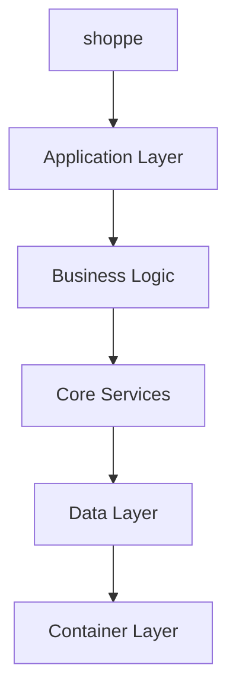

# Architecture Overview - shoppe

## Repository Information
- **Name**: shoppe
- **Language**: Python
- **Size**: 6MB
- **Description**: No description available

## Detected Technology Stack
- **Python**
- **Docker**

## Detected Frameworks
- No specific frameworks detected

## Architecture Pattern Analysis
**Detected Pattern**: unknown

### Architecture Characteristics:
- **Is Microservice**: No
- **Is Monolith**: No
- **Follows MVC**: No
- **Component-based**: No
- **Has Layered Architecture**: No

## System Architecture Analysis

### Repository Structure Analysis
**Directories Found**: .github, .tx, _misc, branding, doc

**Component Indicators**:
- **Frontend**: ❌ Not detected
- **Backend**: ❌ Not detected
- **API Layer**: ❌ Not detected
- **Database Layer**: ❌ Not detected
- **Testing**: ❌ Not detected
- **Configuration**: ❌ Not detected

### Detected API Endpoints
- **GET** `background` (branding/generate_variants.py)
- **GET** `dpi` (branding/generate_variants.py)
- **GET** `width` (branding/generate_variants.py)
- **GET** `height` (branding/generate_variants.py)
- **GET** `replacements` (branding/generate_variants.py)
- **GET** `format` (branding/generate_variants.py)
- **GET** `highlight_args` (doc/_ext/djangodocs.py)
- **GET** `highlight_args` (doc/_ext/djangodocs.py)
- **GET** `ids` (doc/_ext/djangodocs.py)

### Code Pattern Analysis

### Code Organization Patterns:
- **Components**: ❌ No component pattern detected
- **Services**: ✅ 5 services detected
- **Controllers**: ❌ No controller pattern detected
- **Models**: ✅ Model pattern detected
- **Middleware**: ✅ Middleware pattern detected
- **Routes**: ❌ No explicit route definitions detected

### Architecture Diagram

## Dependencies Analysis
**Total Dependencies**: 0
- **Production Dependencies**: 0
- **Development Dependencies**: 0

## Recommendations
⚠️ **Implement comprehensive testing strategy** - No test infrastructure detected
⚠️ **Add monitoring and observability** - No monitoring tools detected
⚠️ **Implement proper configuration management** - Limited configuration structure detected
✅ **Implement dependency injection** for better testability and maintainability
✅ **Add comprehensive error handling** and validation across all layers
✅ **Document API contracts** and component interfaces

## Next Steps
1. Review component dependencies and coupling
2. Implement comprehensive testing strategy
3. Implement monitoring and observability
4. Optimize CI/CD pipeline
