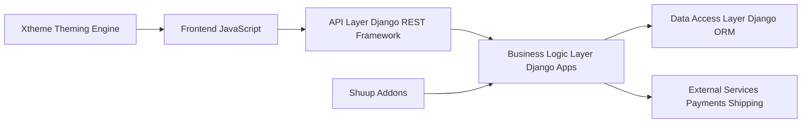

# Shuup Shop Architecture Analysis

This analysis examines the architecture of the Shuup shop based on the provided code snippets.  The system appears to be a multi-tenant e-commerce platform with a modular design, leveraging Django for the backend and various JavaScript frameworks for the frontend.

## Overall System Architecture and Design Patterns

Shuup employs a layered architecture with clear separation of concerns:

* **Presentation Layer (Frontend):**  Uses JavaScript frameworks (Mithril, jQuery, possibly others based on `.eslintrc` and `.jscsrc`) for interactive elements and user interface.  The frontend interacts with the API layer.  Xtheme appears to be a theming engine allowing customization of the frontend presentation.
* **API Layer (Backend - Django REST Framework implied):**  A RESTful API built on top of Django handles requests from the frontend and exposes data and functionality.  This is inferred from the use of JavaScript frameworks on the frontend and the presence of various modules (e.g., `shuup/front`, `shuup/admin`) suggesting a structured API.
* **Business Logic Layer (Django):**  Contains the core business logic of the e-commerce platform, including order management, product catalog, user accounts, and payment processing. This layer is implemented using Django models, views, and forms.  Modularity is achieved through the use of Django apps (e.g., `shuup/core`, `shuup/discounts`, `shuup/campaigns`).
* **Data Access Layer (Django ORM):**  Uses Django's Object-Relational Mapper (ORM) to interact with the database.

The system utilizes several design patterns:

* **Model-View-Controller (MVC):**  A common web application pattern, evident in the Django framework's structure.
* **Plugin/Extension Architecture:**  The presence of numerous modules (e.g., `shuup/addons`, `shuup/themes`) and the `provides` system (mentioned in the changelog) suggests a plugin architecture allowing for extensibility and customization.
* **Layered Architecture:**  The separation into distinct layers promotes maintainability and scalability.

## Component Relationships and Dependencies

The following diagram illustrates the high-level component relationships:

Specific dependencies are evident in the `requirements-dev.txt` and `requirements-tests.txt` files (not shown but implied).  The `setup.py` file manages the project's dependencies and build process.

## Service Architecture and Modularity

Shuup's modularity is a strength.  Each Django app represents a distinct module (e.g., `shuup/core`, `shuup/discounts`). This promotes:

* **Independent Development:**  Teams can work on different modules concurrently.
* **Reusability:**  Modules can be reused in other projects.
* **Maintainability:**  Changes in one module are less likely to affect others.

However, the `provides` system needs further investigation.  Understanding how it manages dependencies and potential circular dependencies is crucial for maintainability.

## Data Flow and System Boundaries

Data flows primarily through the API layer.  The frontend sends requests to the API, which interacts with the business logic layer and the database.  External services (payment gateways, shipping providers) are integrated through the business logic layer.

System boundaries are defined by the API layer.  External systems interact with Shuup through well-defined API endpoints.

## Scalability and Maintainability Considerations

**Strengths:**

* **Modular Design:**  The plugin architecture and separation of concerns improve maintainability.
* **Layered Architecture:**  Facilitates scaling by allowing independent scaling of different layers.
* **Use of Django:**  Provides a robust and well-documented framework.

**Potential Improvements:**

* **API Documentation:**  Comprehensive API documentation is essential for maintainability and integration with external systems.
* **Dependency Management:**  Thoroughly analyze the `provides` system to identify and address potential circular dependencies or overly tight coupling between modules.  Consider using a dependency injection framework for better control.
* **Testing:**  The CI pipeline shows a commitment to testing, but expanding test coverage, particularly integration tests, is crucial.
* **Monitoring and Logging:**  Implement robust monitoring and logging to track system performance and identify potential issues.
* **Caching Strategy:** The code shows some caching attempts, but a more comprehensive caching strategy (e.g., using Redis or Memcached) should be considered for improved performance.
* **Database Optimization:**  Analyze database queries for performance bottlenecks and optimize them as needed.  Consider database sharding or read replicas for scaling.
* **Asynchronous Tasks:** The introduction of a task runner is a good step, but ensure that long-running tasks (e.g., importing products) are handled asynchronously to avoid blocking the main application threads.

## Architectural Strengths and Potential Improvements (Summary)

**Strengths:**

* **Modular Design:** Well-defined modules promote maintainability and independent development.
* **Layered Architecture:**  Clear separation of concerns improves scalability and testability.
* **Comprehensive CI/CD:**  Automated testing and deployment processes are in place.
* **Internationalization Support:**  The use of `gettext` and Transifex indicates support for multiple languages.

**Potential Improvements:**

* **API Documentation:**  Improve API documentation for better maintainability and external integration.
* **Dependency Management:**  Refine the `provides` system to minimize coupling and potential circular dependencies.
* **Enhanced Testing:**  Expand test coverage, especially integration tests, to ensure system stability.
* **Scalability Enhancements:**  Implement a robust caching strategy and consider database optimization techniques for improved performance.
* **Monitoring and Logging:**  Implement comprehensive monitoring and logging for proactive issue detection.
* **Code Style Consistency:**  Enforce consistent code style across the project.

This analysis provides a high-level overview. A more in-depth analysis would require access to the complete codebase and a deeper understanding of the `provides` system and other internal mechanisms.