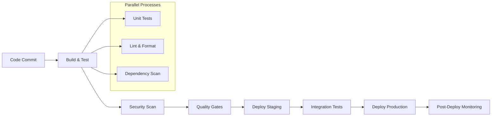

# CI/CD Pipeline Analysis - shoppe

## Current CI/CD Status Analysis

### CI/CD Infrastructure Assessment
- **Pipeline Status**: ✅ CI/CD pipeline detected
- **Platform**: GitHub Actions
- **Automation Level**: Partially Automated
- **Workflow Files**: 2 workflow files found

### Current Capabilities
✅ Continuous Integration
❌ Continuous Deployment
❌ Automated Testing
❌ Deployment Monitoring
❌ Environment Configuration Management

### Gap Analysis
• Continuous Deployment automation
• Automated testing integration
• Deployment monitoring

## Detected CI/CD Configuration

### Detected Workflow Configuration
- **.github/workflows/pypi.yml**: Workflow configuration file
- **.github/workflows/shuup.yml**: Workflow configuration file

### Platform Analysis: GitHub Actions
Excellent integration with GitHub, YAML-based workflows, good ecosystem

### Workflow Assessment
✅ Workflow files present
⚠️ No testing integration detected
✅ Modern CI/CD platform

## Pipeline Architecture Assessment

### Current Architecture Analysis

### Current Pipeline Analysis
- **Platform**: GitHub Actions
- **Workflow Files**: 2 detected
- **Testing Integration**: Missing
- **Automation Level**: Partially Automated

### Enhancement Opportunities
- Add security scanning to existing workflows
- Implement deployment automation
- Add performance testing stage
- Enhance monitoring integration

### Pipeline Maturity Assessment
**Current Level**: Basic

### Recommended Pipeline Architecture

### Architecture Benefits
- **Parallel Execution**: Faster feedback loops with parallel testing
- **Quality Gates**: Automated quality checks prevent bad deployments
- **Security Integration**: Built-in security scanning and compliance
- **Monitoring**: Continuous monitoring and alerting post-deployment

## Recommended CI/CD Pipeline

### Recommended Pipeline Stages

#### 1. Source & Build Stage
- **Trigger**: Code commit to main/develop branch
- **Actions**: 
  - Checkout source code
  - Install dependencies (Language-specific install)
  - Build application (Language-specific build)
  - Generate build artifacts

#### 2. Testing Stage
- **Unit Tests**: Run comprehensive unit test suite
- **Code Coverage**: Generate and validate coverage reports (target: 80%+)
- **Linting**: Code quality and style validation
- **Security Scan**: Dependency vulnerability scanning

#### 3. Quality Gates
- **Code Quality**: Pylint or Flake8 for code linting, Black for code formatting, SonarQube for code quality analysis, Bandit for security analysis
- **Performance**: Performance regression testing
- **Accessibility**: N/A - No frontend detected
- **Documentation**: API documentation validation

#### 4. Deployment Stage
**Build**: Container image creation and scanning
**Development**: Feature branch deployments for testing
**Staging**: Pre-production environment for final validation
**Production**: Live environment with monitoring and rollback capabilities

#### 5. Post-Deployment
- **Health Checks**: Automated application health verification
- **Smoke Tests**: Critical functionality validation
- **Monitoring**: Deployment success metrics and alerting
- **Rollback**: Automated rollback triggers if health checks fail

## Security and Quality Gates

### Security Gates

#### Static Application Security Testing (SAST)
- **Code Scanning**: CodeQL for static analysis, Bandit for Python security issues, Safety for dependency vulnerability scanning
- **Secret Detection**: Scan for exposed API keys, passwords, tokens
- **License Compliance**: Dependency license validation
- **Configuration Security**: Infrastructure as code security validation

#### Dynamic Security Testing
- **Dependency Scanning**: Known vulnerability detection in dependencies
- **Container Scanning**: Docker image vulnerability scanning
- **Infrastructure Scanning**: Infrastructure configuration validation

### Quality Gates

#### Code Quality Metrics
- **Test Coverage**: Minimum 80% line coverage requirement
- **Code Complexity**: Cyclomatic complexity thresholds
- **Technical Debt**: SonarQube quality gate compliance
- **Documentation**: Code documentation coverage requirements

#### Performance Gates
- **Build Time**: Maximum build time thresholds (target: <10 minutes)
- **Bundle Size**: Application size optimization
- **Performance Tests**: Response time and throughput benchmarks

## Deployment Strategy

### Deployment Strategy Recommendations

#### Environment Strategy
- **Development**: Continuous deployment on feature branch merges
- **Staging**: Automatic deployment from main branch
- **Production**: Blue-green deployment with container orchestration

#### Deployment Patterns
**Blue-Green**: Zero-downtime deployment with environment switching
**Canary**: Gradual rollout to subset of users
**Rolling**: Sequential update of instances

#### Infrastructure Requirements
Container orchestration platform (Docker Swarm/Kubernetes), Container registry for image storage, Load balancer for high availability, Monitoring and logging infrastructure, CI/CD pipeline infrastructure

### Rollback Strategy
- **Automated Rollback**: Health check failure triggers
- **Manual Rollback**: One-click rollback capability
- **Database Rollbacks**: N/A - No database detected
- **Canary Rollback**: Gradual traffic shift back to previous version

## Implementation Roadmap

### Implementation Roadmap

#### Phase 1: Basic CI Pipeline (Week 1-2)
- [ ] Setup GitHub Actions (recommended for GitHub repositories) workspace
- [ ] Create basic build and test workflow
- [ ] Configure automated testing on pull requests
- [ ] Setup code coverage reporting

#### Phase 2: Quality & Security (Week 3-4)
- [ ] Implement code quality gates
- [ ] Add security scanning (SAST/dependency scanning)
- [ ] Setup automated linting and formatting
- [ ] Configure performance testing

#### Phase 3: Deployment Automation (Week 5-6)
- [ ] Setup staging environment automation
- [ ] Implement deployment health checks
- [ ] Configure monitoring and alerting
- [ ] Setup rollback procedures

#### Phase 4: Production & Optimization (Week 7-8)
- [ ] Production deployment automation
- [ ] Advanced deployment strategies (blue-green/canary)
- [ ] Performance monitoring integration
- [ ] Documentation and runbook creation

### Success Metrics
- **Deployment Frequency**: Daily deployments (current automation supports frequent releases)
- **Lead Time**: From commit to production deployment < 1 hour
- **MTTR**: Mean time to recovery < 30 minutes
- **Change Failure Rate**: < 5% of deployments require rollback

## Action Items

### Immediate Action Items
🔴 **CRITICAL**: Implement automated testing in pipeline
🟡 **HIGH**: Enhance existing GitHub Actions workflows
🟡 **HIGH**: Implement security scanning in pipeline
🟢 **MEDIUM**: Setup deployment automation
🟢 **MEDIUM**: Configure monitoring and alerting
🔵 **LOW**: Implement advanced deployment strategies

### Dependencies and Prerequisites
- [ ] **Infrastructure Access**: Cloud platform access and permissions
- [ ] **Security Tools**: Security scanning tool selection and setup
- [ ] **Monitoring**: Application and infrastructure monitoring setup
- [ ] **Documentation**: CI/CD process documentation and training

### Risk Mitigation
- **Backup Strategy**: Ensure rollback procedures before production deployment
- **Testing Strategy**: Comprehensive testing before automation
- **Security Review**: Security scan integration before deployment automation
- **Performance Impact**: Monitor performance impact of CI/CD processes

