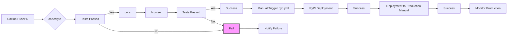

# CI/CD Analysis of Shoppe Repository

This analysis examines the provided Shoppe repository's CI/CD pipeline, build and deployment processes, automation opportunities, quality gates, testing integration, and infrastructure as code practices.  Recommendations for optimization are included.

## Current CI/CD Pipeline Configuration

The repository utilizes GitHub Actions for its CI/CD pipeline, defined in `.github/workflows/pypi.yml` and `.github/workflows/shuup.yml`.

* **`.github/workflows/pypi.yml`**: This workflow handles the release process to PyPI. It's triggered manually via workflow dispatch, requiring a version input. The workflow checks out the specified release branch, sets up Python 3.6 and Node 14, installs dependencies, builds a wheel using `setup.py`, and publishes the wheel to PyPI using a personal access token stored as a GitHub secret.

* **`.github/workflows/shuup.yml`**: This workflow defines the main CI process. It's triggered on pushes and pull requests to the `master` and `2.x` branches.  It consists of three jobs:
    * **`codestyle`**: Runs code style and sanity checks using `flake8`, `isort`, and `black`.  It also executes custom scripts (`_misc/check_sanity.py` and `_misc/ensure_license_headers.py`).
    * **`core`**: Runs unit tests using `pytest` with coverage reporting (Codecov integration).  It also includes steps for managing translations (`makemessages`, `compilemessages`). This job runs across multiple Python versions (3.6, 3.7, 3.8).
    * **`browser`**: Runs browser tests using `pytest` and splinter, generating screenshots on failure. This job uses geckodriver for Firefox and runs only with Python 3.6.

## Build and Deployment Processes

The build process involves:

1. **Dependency Installation:**  Uses `pip` for Python dependencies and `npm` (implicitly, via ESLint configuration) for JavaScript dependencies.
2. **Wheel Building:** Uses `setup.py bdist_wheel` to create a Python wheel distribution.
3. **Static Asset Compilation:**  The process for compiling static assets (JavaScript, CSS, etc.) is not explicitly defined in the provided files but is implied by the presence of ESLint and `.eslintignore`.  A `setup.py build_resources` command suggests a custom build step.
4. **Deployment:** Deployment to PyPI is automated via GitHub Actions.  Deployment to a production environment is not detailed in the provided files.

## Automation Opportunities

Several automation opportunities exist:

* **Automated Release:** While the PyPI release is automated, integrating automatic releases based on semantic versioning (e.g., using tags) would improve the workflow.
* **Deployment Automation:**  The current pipeline lacks automated deployment to a production environment.  This should be integrated using a deployment tool (e.g., Ansible, Kubernetes, etc.) and appropriate secrets management.
* **End-to-End Testing:** Expanding the testing suite to include end-to-end tests would significantly improve confidence in the application's functionality.
* **Automated Translation Updates:** The Transifex integration is manual.  Automating the pull of translations from Transifex into the repository would streamline the localization process.
* **Static Analysis:** Integrating static analysis tools (e.g., SonarQube, Bandit) could identify potential security vulnerabilities and code quality issues earlier in the development cycle.

## Quality Gates and Testing Integration

The pipeline includes several quality gates:

* **Code Style Checks:** `flake8`, `isort`, and `black` enforce code style consistency.
* **Unit Tests:** `pytest` provides comprehensive unit test coverage.
* **Browser Tests:**  Spinter provides browser-based testing.
* **Code Coverage:** Codecov integrates with pytest to track test coverage.

However, improvements are needed:

* **More Robust Testing:**  Adding integration tests and end-to-end tests would significantly improve the quality assurance process.
* **Test Reporting:**  While Codecov provides coverage, integrating a more comprehensive test reporting system (e.g., Allure) would provide better visibility into test results.

## Infrastructure as Code Practices

The repository shows some aspects of infrastructure as code:

* **Docker:** The `.dockerignore` file suggests the use of Docker for containerization.  The presence of `Dockerfile` and `docker-compose*` indicates a basic Docker setup.

However, improvements are needed:

* **Comprehensive Docker Configuration:**  The provided Dockerfiles are minimal.  More comprehensive Dockerfiles and docker-compose configurations should be implemented for better reproducibility and scalability.
* **Infrastructure-as-Code Tools:**  Consider using tools like Terraform or Ansible to manage infrastructure, improving consistency and automation.

## Recommendations for Optimizing CI/CD Workflows and Deployment Strategies

1. **Implement Automated Releases:** Configure GitHub Actions to automatically create releases based on Git tags following semantic versioning.

2. **Automate Deployment:** Integrate a deployment tool (e.g., Ansible, Kubernetes, AWS CodeDeploy) into the GitHub Actions workflow to automate deployment to staging and production environments.  Use environment variables and secrets management for sensitive information.

3. **Expand Testing:**  Add integration and end-to-end tests to the CI pipeline.  Consider using tools like Selenium or Cypress for end-to-end testing.

4. **Automate Translation Updates:**  Create a GitHub Actions workflow to automatically pull translations from Transifex.

5. **Integrate Static Analysis:**  Add static analysis tools (e.g., SonarQube, Bandit) to the CI pipeline to detect potential security vulnerabilities and code quality issues.

6. **Improve Docker Configuration:**  Develop comprehensive Dockerfiles and docker-compose configurations for development, testing, and production environments.  Consider using multi-stage builds to optimize image sizes.

7. **Adopt Infrastructure-as-Code:** Use tools like Terraform or Ansible to manage infrastructure, ensuring consistency and repeatability.

8. **Implement a robust logging and monitoring system:**  This will help in debugging and identifying issues quickly.

9. **Implement a rollback strategy:** In case of deployment failures, having a rollback strategy in place will help to quickly revert to a stable version.

10. **Use a CI/CD platform:** Consider using a dedicated CI/CD platform like GitLab CI, Jenkins, or CircleCI for better management and scalability.

## Mermaid Diagram of CI/CD Pipeline

This diagram visualizes the flow of the CI/CD pipeline, highlighting the different stages and potential failure points.  The manual deployment step to production should be automated as recommended above.