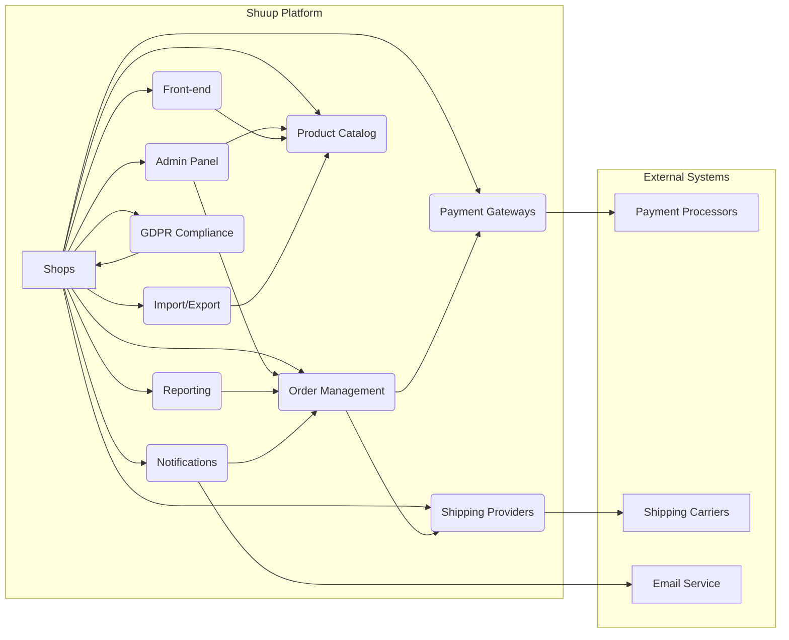

# Shuup E-commerce Platform High-Level Design Analysis

This document provides a high-level design analysis of the Shuup e-commerce platform based on the provided code snippets.  The analysis focuses on system architecture, key components, APIs, data models, and integration patterns.  Due to the limited codebase provided, this analysis is necessarily incomplete and focuses on the aspects that can be inferred from the available information.

## I. High-Level System Design

The Shuup platform appears to be a modular, multi-tenant e-commerce system built using Python (Django) and JavaScript (likely React or a similar framework).  It supports multiple shops, suppliers, and integrates with various external services.

**Key Architectural Aspects:**

* **Multi-tenancy:** The system supports multiple shops, each with its own configuration and data.
* **Modularity:** The platform is built using a plugin architecture (evidenced by the numerous `.po` files for translation and the mention of "provides" in the code).  This allows for extensibility and customization.
* **API-driven:**  The system likely exposes APIs for various functionalities, including product catalog access and order management.  The mention of a "Catalog API" suggests a RESTful or GraphQL interface.
* **Internationalization:** The extensive use of `.po` files indicates robust support for multiple languages.

## II. Low-Level Component Design

Based on the provided files, we can identify several key components:

* **Admin Panel:** A Django-based administration interface for managing shops, products, orders, suppliers, and other aspects of the platform.  It uses Picotable for data presentation.
* **Front-end:** A JavaScript-based user interface for customers to browse products, place orders, and manage their accounts.  It utilizes various JavaScript libraries (jQuery, Lodash, Moment.js, Mithril).
* **Product Catalog:**  Manages product information, including variations, attributes, and pricing.  It interacts with the Catalog API.
* **Order Management:** Handles order processing, including payment and shipping integration.
* **Payment Gateways:** Integrates with various payment processors.
* **Shipping Providers:** Integrates with shipping carriers.
* **Reporting:** Generates reports on sales, inventory, and other key metrics.
* **Notifications:** Sends email and other notifications to customers and administrators.  Uses a templating system (likely Jinja2).
* **GDPR Compliance:** Implements features to comply with GDPR regulations.
* **Import/Export:** Allows for importing and exporting product data and other information.

## III. API Documentation and Interfaces

The provided code doesn't contain explicit API specifications. However, the mention of a "Catalog API" suggests a well-defined interface for accessing product data.  This API likely provides endpoints for:

* Retrieving product lists (with filtering and pagination).
* Retrieving individual product details.
* Searching for products.

## IV. Database Schema and Data Models

The database schema is not explicitly defined, but we can infer some key entities based on the code and changelog:

* **Shop:** Represents an individual e-commerce store.
* **Product:** Represents a product offered for sale.  Includes attributes, variations, and pricing information.
* **Supplier:** Represents a vendor supplying products.
* **Order:** Represents a customer order.
* **Order Line:** Represents an item in an order.
* **Shipment:** Represents a shipment of products.
* **Contact:** Represents a customer or other contact.
* **User:** Represents a platform user (administrator, shop staff, etc.).
* **Category:** Represents a product category.
* **Attribute:** Represents a product attribute (e.g., color, size).
* **Manufacturer:** Represents a product manufacturer.
* **Media:** Represents product images and other media.
* **Discount:** Represents a discount applied to products or orders.
* **TaxClass:** Represents a tax class for products.
* **Carrier:** Represents a shipping carrier.
* **PaymentMethod:** Represents a payment method.
* **LogEntry:** Stores audit logs of system events.

## V. System Integration Patterns

Shuup utilizes several integration patterns:

* **Plugin Architecture:**  Extensibility through plugins.
* **API Integration:**  Integration with external services (payment processors, shipping carriers, email services) via APIs.
* **Event-driven Architecture:**  The use of signals suggests an event-driven approach for handling certain events (e.g., order creation, email sending).

## VI. Recommendations

* **Detailed API Documentation:** Generate comprehensive API documentation (using Swagger or similar tools) to clearly define the interfaces.
* **Database Schema Diagram:** Create an ER diagram to visualize the database schema and relationships between entities.
* **Component Diagrams:**  Develop more detailed component diagrams to illustrate the interactions between different parts of the system.
* **Security Review:** Conduct a thorough security review to identify and address potential vulnerabilities.
* **Testing Strategy:** Implement a robust testing strategy, including unit, integration, and end-to-end tests.

This analysis provides a starting point for understanding the Shuup platform's architecture.  Further analysis would require access to the complete source code and database schema.