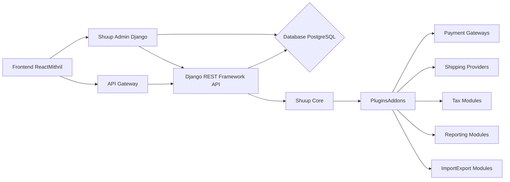

# Shuup E-commerce Platform High-Level Design Analysis

This document provides a high-level design analysis of the Shuup e-commerce platform based on the provided code snippets.  The analysis focuses on system architecture, component design, API interfaces, database schema, and integration patterns.  Due to the limited codebase provided, this analysis is incomplete and relies on inferences from the available information.  A full analysis would require access to the complete source code.

## I. High-Level System Design

The Shuup platform appears to be a modular, multi-tenant e-commerce system built using Python (Django) and JavaScript.  It supports multiple shops, suppliers, and integrates with various external services.

**Components:**

* **Frontend:**  Uses a combination of React and Mithril (as indicated by globals in `.eslintrc`).  Handles user interaction, product display, and checkout processes.
* **API Gateway:**  (Inferred)  Manages requests to the backend services, potentially handling authentication and routing.
* **Backend (Django):**  The core of the application, built using the Django framework.  Includes the Django REST Framework for API access.
* **Shuup Core:**  (Inferred)  Provides core functionalities like product management, order processing, user accounts, and shop configuration.
* **Plugins/Addons:**  A modular system allowing for extensibility through plugins for payment gateways, shipping providers, tax calculations, reporting, and import/export.
* **Shuup Admin:**  A Django-based administration interface for managing products, orders, users, and other aspects of the platform.
* **Database:**  Likely PostgreSQL (common choice for Django applications). Stores product information, orders, users, and configuration data.

## II. Low-Level Component Design

**A. Product Management:**

The system manages products with attributes, variations, and media.  Suppliers seem to play a crucial role in product management.  The `ProductVariationResult` suggests caching mechanisms for performance optimization.

**B. Order Management:**

Orders are processed through a multi-step checkout process.  The system handles shipping, payment, taxes, and refunds.  The presence of `Shipment` and related models indicates support for tracking shipments.

**C. User Management:**

The system supports multiple user roles (superusers, staff, customers).  User permissions are managed through groups and granular permissions.  GDPR compliance is addressed through consent management.

**D. Notification System:**

A notification system (`shuup.notify`) allows sending emails and other notifications.  It uses templates and supports custom actions.

## III. API Documentation and Interfaces

The system uses the Django REST Framework to expose APIs.  The specific API endpoints are not detailed in the provided code, but based on the system functionality, we can infer the existence of APIs for:

* **Product Management:**  CRUD operations for products, attributes, variations, and media.
* **Order Management:**  Viewing order details, creating orders, managing shipments, and processing refunds.
* **User Management:**  User authentication, registration, and profile management.
* **Shop Management:**  Configuring shop settings, managing staff, and accessing analytics.
* **Plugin Management:**  (Inferred)  APIs for managing and interacting with plugins.

## IV. Database Schema and Data Models

Based on the code and changelog, the database schema includes tables for:

* **Shop:**  Represents an individual online store.
* **Product:**  Represents a product offered for sale.
* **ProductAttribute:**  Represents attributes of a product (e.g., color, size).
* **ProductVariation:**  Represents variations of a product (e.g., different sizes of the same shirt).
* **Order:**  Represents a customer order.
* **OrderLine:**  Represents an item in an order.
* **Shipment:**  Represents a shipment of an order.
* **User:**  Represents a user of the system (customer, staff, or admin).
* **Supplier:**  Represents a supplier of products.
* **Contact:**  Represents a customer or other contact.
* **LogEntry:**  Stores system logs.
* **EmailTemplate:**  Stores reusable email templates.
* **Consent:**  Stores GDPR consent information.
* **Media:**  Stores product images and other media.

## V. System Integration Patterns

* **Plugin Architecture:**  Shuup uses a plugin architecture for extensibility.  Plugins can extend core functionalities and add new features.
* **Event-Driven Architecture:**  The use of signals (e.g., `shuup.notify.base.Variable`) suggests an event-driven architecture for communication between components.
* **External Service Integration:**  The system integrates with external payment gateways and shipping providers.

## VI. Recommendations

* **Detailed API Documentation:**  Generate comprehensive API documentation using tools like Swagger or OpenAPI.
* **Improved Plugin Management:**  Develop a robust plugin management system with versioning, dependency management, and automated testing.
* **Enhanced Security:**  Implement robust security measures, including input validation, authentication, and authorization.
* **Scalability and Performance:**  Optimize database queries and implement caching strategies to improve performance and scalability.
* **Comprehensive Testing:**  Implement a comprehensive testing strategy, including unit, integration, and end-to-end tests.

This analysis provides a high-level overview of the Shuup platform's design.  A more detailed analysis would require access to the complete source code and further investigation.