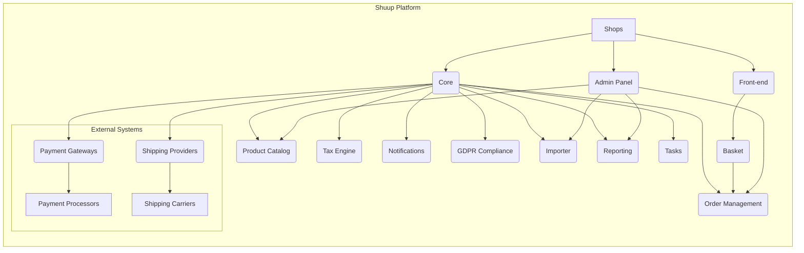

# Shuup E-commerce Platform High-Level Design Analysis

This document provides a high-level design analysis of the Shuup e-commerce platform based on the provided code snippets.  The analysis focuses on system architecture, key components, APIs, data models, and integration patterns.  Due to the limited codebase provided, this analysis is incomplete and serves as a starting point for a more comprehensive review.

## I. High-Level System Design

The Shuup platform appears to be a modular, multi-tenant e-commerce system built using Python (Django) and JavaScript (likely React or similar).  It supports multiple shops, suppliers, and integrates with various external services.

**Diagram:**

**Key Components:**

* **Shops:** Individual e-commerce instances managed within the platform.
* **Admin Panel:**  A Django-based administration interface for managing shops, products, orders, suppliers, and other aspects of the platform.
* **Front-end:** A JavaScript-based user interface for customers to browse products, manage their accounts, and place orders.
* **Core:** The central component providing core functionalities like user management, data models, and common services.
* **Order Management:** Handles order creation, processing, fulfillment, and refunds.
* **Product Catalog:** Manages product information, variations, inventory, and pricing.
* **Payment Gateways:** Integrates with various payment processors.
* **Shipping Providers:** Integrates with shipping carriers.
* **Tax Engine:** Calculates taxes based on various rules and regulations.
* **Notifications:** Sends emails and other notifications to customers and administrators.
* **GDPR Compliance:** Implements features to comply with GDPR regulations.
* **Importer:** Allows importing product data and other information from external sources.
* **Reporting:** Generates reports on sales, inventory, and other key metrics.
* **Tasks:** Manages asynchronous tasks.
* **Basket:** Manages the customer's shopping cart.

## II. Low-Level Component Design Details

**A. Product Catalog:**

The product catalog likely uses a relational database to store product information.  The `.tx/config` file suggests a complex structure with multiple modules (addons, admin, core, etc.) contributing to the product model.  Product variations are managed, potentially using a separate model or a complex attribute system.

**B. Order Management:**

The order management system likely uses a state machine to track the order lifecycle (e.g., created, processing, shipped, completed).  It integrates with payment gateways and shipping providers to manage payments and fulfillments.

**C. Admin Panel:**

The admin panel is built using Django's admin framework, extended with custom views, forms, and templates.  It leverages JavaScript for enhanced user interface features.  The use of Picotable suggests a focus on efficient data presentation in lists.

**D. Front-end:**

The front-end is built using JavaScript, likely a framework like React.  It interacts with the backend APIs to fetch product data, manage the shopping cart, and process orders.  The use of Mithril, jQuery, and Lodash is indicated in the `.eslintrc` file.

## III. API Documentation and Interfaces

The provided code doesn't contain explicit API documentation.  However, based on the code structure, we can infer the existence of RESTful APIs for the front-end to interact with the backend.  These APIs would likely expose endpoints for:

* Product retrieval and search
* Cart management (add, remove, update)
* Order placement
* User authentication and account management
* Payment processing
* Shipping calculations

## IV. Database Schema and Data Models

The database schema is not explicitly defined, but based on the code, we can infer the existence of models for:

* **Shop:**  Represents an individual e-commerce shop.
* **Product:** Represents a product in the catalog.
* **ProductVariation:** Represents variations of a product (e.g., size, color).
* **Order:** Represents a customer order.
* **OrderLine:** Represents an item in an order.
* **Customer:** Represents a customer account.
* **Supplier:** Represents a product supplier.
* **Shipment:** Represents a shipment of products.
* **PaymentMethod:** Represents a payment method.
* **ShippingMethod:** Represents a shipping method.
* **TaxClass:** Represents a tax class.
* **Attribute:** Represents product attributes.
* **Category:** Represents product categories.

## V. System Integration Patterns

Shuup uses several integration patterns:

* **Plugin Architecture:**  The system is highly modular, allowing for extensions through plugins or addons.
* **Service Providers:**  Abstraction of external services (payment gateways, shipping carriers) through interfaces.
* **Event-driven Architecture:**  The use of signals suggests an event-driven approach for handling various events (e.g., order creation, payment processing).
* **Asynchronous Tasks:**  The `Tasks` component suggests the use of asynchronous task processing for long-running operations.

## VI. Recommendations

* **Comprehensive API Documentation:** Generate detailed API documentation using tools like Swagger or OpenAPI.
* **Database Schema Diagram:** Create a visual representation of the database schema using a tool like ERwin or MySQL Workbench.
* **Detailed Component Specifications:**  Document the functionality and interfaces of each key component in detail.
* **Testing Strategy:** Implement a comprehensive testing strategy including unit, integration, and end-to-end tests.
* **Security Considerations:**  Address security concerns related to data protection, authentication, and authorization.

This analysis provides a high-level overview.  A more in-depth analysis would require access to the complete source code and detailed specifications.