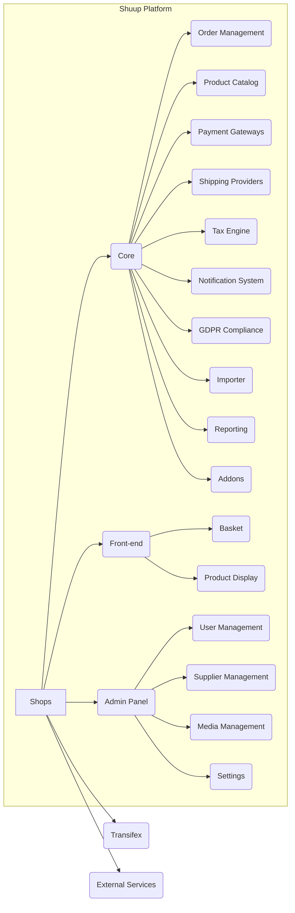

# Shuup E-commerce Platform High-Level Design Analysis

This document provides a high-level design analysis of the Shuup e-commerce platform based on the provided code snippets.  The analysis focuses on system architecture, key components, APIs, data models, and integration patterns.  Due to the limited codebase provided, this analysis is necessarily incomplete and relies on inferences from the available information.

## I. High-Level System Design

The Shuup platform appears to be a modular, multi-tenant e-commerce system built using Python (Django) and JavaScript (likely React or similar).  It supports multiple shops, suppliers, and integrates with various external services.

**Key Architectural Features:**

* **Modular Design:** The system is composed of independent modules (e.g., `shuup.core`, `shuup.admin`, `shuup.front`, various addons). This promotes maintainability and extensibility.
* **Multi-tenancy:**  The platform supports multiple shops, each with its own configuration and data.
* **Plugin Architecture:**  The `xtheme` directory and references to plugins suggest a plugin architecture for extending functionality, particularly in the front-end.
* **Internationalization:**  Extensive use of `gettext` and integration with Transifex indicate strong support for multiple languages.
* **Asynchronous Tasks:** The presence of a task runner suggests asynchronous processing for tasks like importing data.

## II. Low-Level Component Design Details

**A. Core Components:**

* **`shuup.core`:** This module likely contains the core business logic, including data models for products, orders, customers, shops, and suppliers.
* **`shuup.admin`:** This module provides the administrative interface for managing the platform.  It utilizes Django's admin framework, extended with custom views and templates.
* **`shuup.front`:** This module handles the customer-facing aspects of the e-commerce site.  It includes templates, views, and potentially JavaScript components for product display, shopping cart, checkout, etc.
* **`shuup.xtheme`:** This module seems to manage themes and front-end plugins, allowing customization of the storefront's appearance and functionality.

**B.  Component Interactions:**

The `core` module acts as a central hub, providing data and services to the `admin` and `front` modules.  The `xtheme` module allows customization of the `front` module's presentation and behavior.

## III. API Documentation and Interfaces

The provided code doesn't explicitly define APIs, but we can infer some interfaces:

* **Product Catalog API:**  The `core` module likely exposes an API for retrieving product information, including prices, availability, and variations.  The `front` module uses this API to display products.  The new Catalog API mentioned in the changelog suggests improvements in performance and data annotation.
* **Order Management API:** The `core` module provides an API for creating, updating, and managing orders.  The `admin` module uses this API to display and manipulate orders.
* **Payment Gateway API:**  The system integrates with payment gateways through an API, allowing for flexible payment processing.
* **Shipping Provider API:** Similar to payment gateways, shipping providers are likely integrated via an API.
* **Notification API:** The `shuup.notify` module suggests an API for sending notifications (e.g., order confirmations, password resets) via email or other channels.

## IV. Database Schema and Data Models

Based on the `.tx/config` file, the database schema includes tables for various aspects of the e-commerce platform:  products, categories, orders, customers, suppliers, shops,  taxes, discounts, and more.  The models are likely organized within the `shuup.core` module.  The presence of many PO files suggests extensive use of model translations.

## V. System Integration Patterns

* **External Services:** The system integrates with Transifex for translation management and likely other external services (payment gateways, shipping providers, etc.).
* **Asynchronous Processing:** The task runner facilitates asynchronous processing of long-running tasks, improving responsiveness.
* **Plugin Architecture:** The `xtheme` module suggests a plugin architecture for extending functionality, both front-end and back-end.

## VI. Recommendations

* **Detailed API Documentation:** Generate comprehensive API documentation for all key modules and interfaces.  This will be crucial for developers extending or integrating with the platform.
* **Data Model Diagrams:** Create Entity-Relationship Diagrams (ERDs) to visualize the database schema and relationships between data models.
* **Component Interaction Diagrams:**  Develop sequence diagrams to illustrate the interactions between key components during typical workflows (e.g., placing an order, managing products).
* **Improved Changelog:** The changelog should include more detailed descriptions of changes, including breaking changes and their impact.
* **Testing Strategy:**  Document the testing strategy, including unit, integration, and end-to-end tests.

This analysis provides a starting point for understanding the Shuup e-commerce platform's design.  A more comprehensive analysis would require access to the complete source code and detailed design documentation.