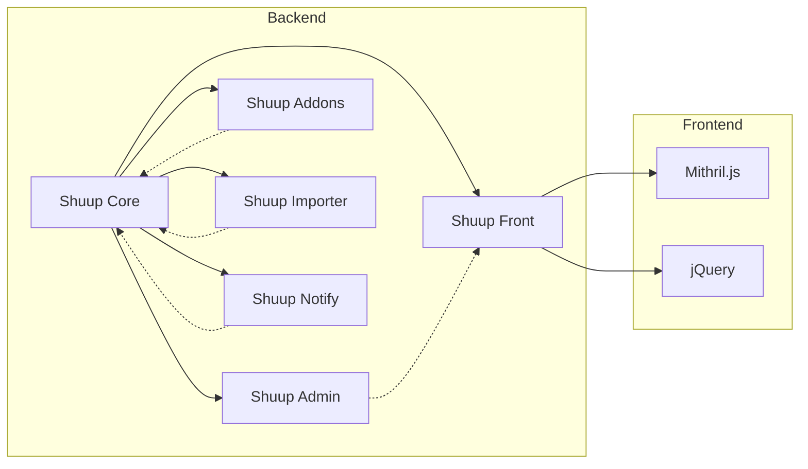

# Shuup E-commerce Platform Codebase Analysis

This analysis examines the provided codebase for a Shuup e-commerce platform, focusing on architecture, code quality, dependencies, security, performance, documentation, testing, and DevOps/CI/CD aspects.

## 1. Architecture Analysis

The Shuup platform exhibits a microservice-like architecture, with distinct modules (e.g., `shuup.admin`, `shuup.front`, `shuup.core`) handling specific functionalities.  The `provides` system seems to be a crucial mechanism for extensibility and customization, allowing modules to inject functionality into other parts of the application.  This approach promotes modularity and maintainability but requires careful management of dependencies and communication between modules.

The use of Django for the backend and a mix of JavaScript frameworks (Mithril, jQuery) for the frontend suggests a layered architecture.  However, the integration between the frontend and backend isn't explicitly detailed in the provided code snippets.  Further investigation is needed to understand the communication protocols (e.g., REST APIs, GraphQL) and data exchange formats used.

**Recommendation:**  Document the overall architecture using a diagram (e.g., Mermaid) to clearly illustrate the relationships between modules, data flow, and communication mechanisms.  This would significantly improve understanding and maintainability.

## 2. Code Quality Assessment

The `.eslintrc` file indicates a commitment to code quality using ESLint for JavaScript.  The rules enforced suggest a preference for consistency and readability.  However, the `.jscsrc` file shows the use of JSCS, which is now deprecated in favor of ESLint.  This inconsistency should be addressed.

The Python codebase uses tools like `flake8`, `isort`, and `black` for linting and formatting, demonstrating a focus on code style.  However, the absence of code complexity analysis tools (e.g., `pylint`, `radon`) is a potential concern.

**Recommendations:**

* **Consolidate linting:** Remove the deprecated JSCS configuration and rely solely on ESLint.
* **Add complexity analysis:** Integrate tools like `pylint` or `radon` to identify complex code sections that might require refactoring.
* **Code reviews:** Implement a formal code review process to catch potential issues early.

## 3. Dependency Analysis

The `requirements-dev.txt` and `requirements-tests.txt` files (not shown but implied) specify project dependencies.  The `pypi.yml` workflow shows the use of `setuptools` and `wheel` for packaging, and the installation of `shuup` itself suggests a dependency on other Shuup packages.

**Recommendations:**

* **Dependency management:** Use a dependency management tool like `poetry` or `pip-tools` to manage dependencies more effectively, ensuring reproducibility and preventing conflicts.
* **Security scanning:** Integrate a dependency security scanner (e.g., `bandit`, `safety`) into the CI/CD pipeline to detect vulnerabilities in dependencies.
* **Version pinning:** Use specific version numbers (or ranges) for dependencies to avoid unexpected behavior due to updates.

## 4. Security Review

The codebase shows some security awareness (e.g., sanitizing user input, preventing XSS attacks).  However, a comprehensive security audit is needed to identify potential vulnerabilities.

**Recommendations:**

* **Input validation:**  Thoroughly validate all user inputs to prevent injection attacks (SQL injection, XSS).
* **Authentication and authorization:**  Ensure robust authentication and authorization mechanisms are in place, with proper access control and session management.
* **Security testing:** Conduct regular penetration testing and security audits to identify and address vulnerabilities.
* **HTTPS:** Ensure all communication uses HTTPS.

## 5. Performance Insights

The codebase includes some performance optimization attempts (e.g., caching using `lru_cache`).  However, without performance profiling and benchmarking, it's difficult to pinpoint specific bottlenecks.

**Recommendations:**

* **Profiling:** Use profiling tools to identify performance bottlenecks in both the frontend and backend code.
* **Database optimization:** Optimize database queries, indexes, and schema design.
* **Caching:** Implement more comprehensive caching strategies (e.g., Redis, Memcached) for frequently accessed data.
* **Load testing:** Conduct load testing to assess the platform's scalability and identify performance limitations under stress.

## 6. Documentation Quality

The `CHANGELOG.md` provides a good overview of changes, adhering to Semantic Versioning.  However, more comprehensive documentation is needed, including API documentation, user guides, and developer guides.

**Recommendations:**

* **API documentation:** Generate API documentation using tools like Sphinx or Swagger.
* **User guides:** Create user guides for administrators and customers.
* **Developer guides:** Provide detailed developer guides on extending and customizing the platform.
* **Internal documentation:**  Document design decisions, architecture, and complex code sections using comments and internal wikis.

## 7. Testing Strategy

The repository shows a CI/CD pipeline using GitHub Actions, with tests for Python (`pytest`) and browser tests (`splinter`).  The `SHUUP_TESTS_CI` environment variable suggests a distinction between local and CI testing environments.

**Recommendations:**

* **Test coverage:**  Increase test coverage to ensure a higher level of confidence in the codebase.  Aim for high coverage in critical areas.
* **Test types:**  Explore additional testing types, such as integration tests, end-to-end tests, and performance tests.
* **Test reporting:**  Improve test reporting to provide more detailed information on test failures.

## 8. DevOps & CI/CD

The `pypi.yml` workflow demonstrates a CI/CD pipeline for publishing to PyPI.  The `shuup.yml` workflow performs code style checks, sanity checks, and tests.  The use of Docker is indicated in the `.dockerignore` file.

**Recommendations:**

* **Infrastructure as Code:** Use tools like Terraform or Ansible to manage infrastructure.
* **Containerization:**  Further leverage Docker for consistent development, testing, and deployment environments.
* **Monitoring and logging:** Implement robust monitoring and logging to track performance, errors, and security events.
* **Deployment automation:** Automate the deployment process using tools like Kubernetes or Docker Swarm.

This analysis provides a starting point for improving the Shuup e-commerce platform.  Addressing the recommendations will enhance code quality, security, performance, and maintainability.  Remember that a thorough assessment requires deeper code inspection and testing.