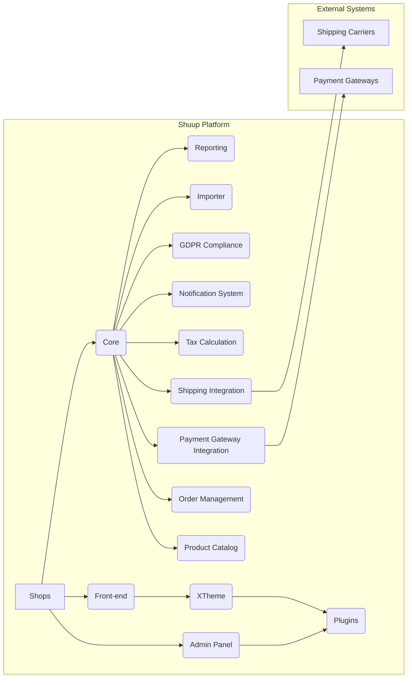

# Shuup E-commerce Platform High-Level Design Analysis

This document provides a high-level design analysis of the Shuup e-commerce platform based on the provided code snippets.  The analysis focuses on system architecture, key components, APIs, data models, and integration patterns.  Due to the limited code samples, this analysis is necessarily incomplete and relies on inferences based on common e-commerce platform design patterns.

## I. High-Level System Design

The Shuup platform appears to be a modular, multi-tenant e-commerce system built using Python (Django) and JavaScript (likely React or similar).  It supports multiple shops, suppliers, and extensibility through plugins and modules.

**Key Components:**

* **Shops:** Represents individual e-commerce stores, each with its own configuration and data.
* **Admin Panel:**  A Django-based administration interface for managing shops, products, orders, suppliers, and other aspects of the platform.
* **Front-end:** The customer-facing website built using JavaScript and possibly a framework like React.  It interacts with the backend APIs to display products, manage shopping carts, and process orders.
* **Core:** The central component providing core functionality like product catalog management, order processing, payment and shipping integrations, tax calculations, and user management.
* **Product Catalog:** Manages product information, including variations, images, and pricing.
* **Order Management:** Handles order creation, processing, fulfillment, and tracking.
* **Payment Gateway Integration:** Integrates with various payment gateways to process online payments.
* **Shipping Integration:** Integrates with shipping carriers to calculate shipping costs and manage shipments.
* **Tax Calculation:** Handles tax calculations based on various tax rules and jurisdictions.
* **Notification System:** Sends notifications to customers and administrators via email or other channels.
* **GDPR Compliance:** Implements features to ensure compliance with GDPR regulations.
* **Importer:** Allows importing product data and other information from external sources.
* **Reporting:** Provides tools for generating reports on sales, inventory, and other key metrics.
* **XTheme:** A theming engine allowing customization of the front-end appearance.
* **Plugins:** Extend the functionality of the XTheme.

## II. Low-Level Component Design Details

**A. Product Catalog:**

The product catalog likely uses a relational database model with tables for products, variations, categories, manufacturers, and media.  The `.eslintrc` file suggests the use of Mithril, jQuery, and Lodash in the front-end, indicating a client-side framework for managing product display and interaction.

**B. Order Management:**

The order management system likely uses a state machine to track order status transitions.  Data models include `Order`, `OrderLine`, `Shipment`, and `Payment`.  The system integrates with payment and shipping gateways through APIs.

**C. Notification System:**

The notification system utilizes a pluggable architecture, allowing different notification methods (e.g., email, SMS) to be added easily.  The `shuup.notify` section in `.tx/config` indicates the use of `gettext` for internationalization of notification messages.

**D. GDPR Compliance:**

The GDPR compliance features likely involve mechanisms for managing user consent, data anonymization, and data deletion requests.  The presence of a `GDPR` section in `.tx/config` suggests that these features are localized.

**E. Importer:**

The importer likely supports various data formats (CSV, XML, etc.) and allows mapping of external data fields to internal data models.  The `.github/workflows/shuup.yml` file shows automated testing of the importer.

## III. API Documentation and Interfaces

The provided code snippets do not contain explicit API documentation. However, based on the system architecture, we can infer the existence of RESTful APIs for communication between the front-end and the backend.  These APIs would likely expose endpoints for:

* Product retrieval and search
* Shopping cart management
* Order placement
* User authentication and authorization
* Payment processing
* Shipping calculations

## IV. Database Schema and Data Models

Based on the code and file names, the database schema likely includes tables for:

* **Shop:** Shop-specific configuration and data.
* **Product:** Product details (name, description, price, etc.).
* **ProductVariation:** Product variations (size, color, etc.).
* **Category:** Product categories.
* **Manufacturer:** Product manufacturers.
* **Order:** Order information (customer, date, total, etc.).
* **OrderLine:** Order line items (product, quantity, price).
* **Shipment:** Shipping information.
* **Payment:** Payment information.
* **User:** Customer and administrator accounts.
* **Supplier:** Supplier information and associated products.
* **Media:** Product images and other media files.
* **TaxClass:** Tax classes for products.
* **Contact:** Customer information.
* **LogEntry:** Audit trail of system actions.

## V. System Integration Patterns

Shuup employs several integration patterns:

* **Plugin Architecture:** Extensibility through plugins for XTheme and other modules.
* **API Integration:** Integration with payment gateways and shipping carriers via APIs.
* **Event-driven Architecture:**  The use of signals (e.g., `shuup.notify.base.Variable`) suggests an event-driven architecture for handling asynchronous operations and notifications.

## VI. Recommendations

* **Formal API Documentation:** Generate comprehensive API documentation using tools like Swagger or OpenAPI.
* **Data Model Diagrams:** Create Entity-Relationship Diagrams (ERDs) to visualize the database schema.
* **Detailed Component Specifications:**  Document the internal workings of key components (e.g., order management, payment processing) with detailed specifications and flowcharts.
* **Testing Strategy:** Expand the testing strategy to include integration tests and end-to-end tests.
* **Deployment Pipeline:** Implement a robust CI/CD pipeline to automate the build, testing, and deployment process.

This analysis provides a foundational understanding of the Shuup platform's design.  Further analysis would require access to the complete source code and detailed design documents.