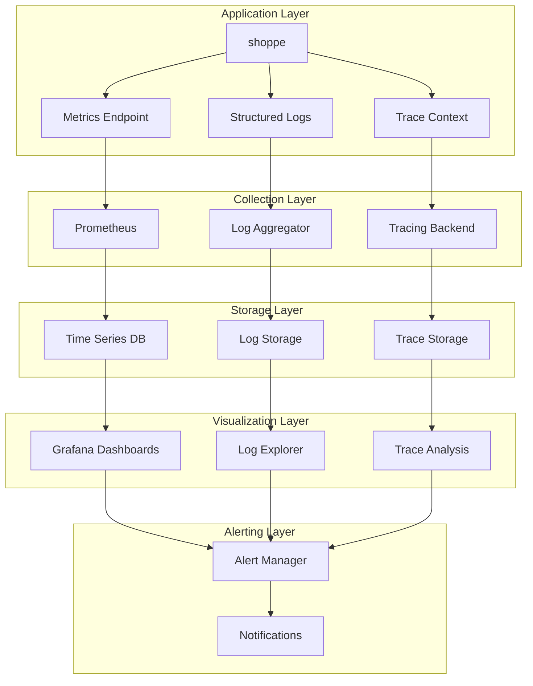

# Monitoring Tools Analysis - shoppe

## Current Monitoring Setup Analysis

### Current Monitoring Infrastructure
- **Monitoring Tools Detected**: ❌ No monitoring tools detected
- **Logging Implementation**: ✅ Logging found in codebase
- **Metrics Collection**: ❌ No metrics collection found
- **Distributed Tracing**: ❌ No tracing detected

### Detected Tools Analysis
- No specific monitoring tools found in the codebase

### Current Gaps
• Application metrics collection
• Distributed tracing
• APM solution deployment

## Detected Monitoring Tools
- No monitoring tools detected in the repository

## Observability Assessment

### Three Pillars of Observability Assessment

#### 📊 Metrics
- **Status**: ❌ Not Implemented
- **Coverage**: No metrics collection detected
- **Recommendation**: Implement comprehensive metrics collection

#### 📝 Logs
- **Status**: ✅ Basic Logging Found
- **Coverage**: Application logging present
- **Recommendation**: Implement structured logging with correlation IDs

#### 🔍 Traces
- **Status**: ❌ No Tracing
- **Coverage**: No request tracing found
- **Recommendation**: Implement distributed tracing for request flow visibility

### Overall Observability Score
**Score**: 3/10
**Assessment**: Poor - Significant observability gaps exist

## Recommended Monitoring Stack

### Application Performance Monitoring (APM)
- **Primary Choice**: Application-specific APM solution (New Relic, DataDog, or AppDynamics)
- **Alternative**: Open-source stack: Prometheus + Grafana + Jaeger for cost-effective monitoring
- **Reasoning**: Based on Python technology stack and unknown architecture pattern

### Metrics and Monitoring
- **Metrics Collection**: Prometheus + cAdvisor for containers
- **Time Series Database**: Prometheus or InfluxDB
- **Visualization**: Grafana for dashboards and alerting
- **Alerting**: AlertManager for notification routing

### Logging Infrastructure
- **Log Aggregation**: Centralized logging with ELK Stack or cloud-native logging solutions
- **Log Storage**: Centralized logging solution
- **Log Analysis**: Kibana or Grafana for log exploration
- **Log Shipping**: Fluentd or Fluent Bit

### Infrastructure Monitoring

- **Container Monitoring**: cAdvisor for container metrics
- **Orchestration**: Docker Swarm monitoring
- **Host Monitoring**: Node Exporter for system metrics
- **Network Monitoring**: Network policy and ingress monitoring

## Implementation Roadmap

### Implementation Phases

#### Phase 1: Foundation (Weeks 1-2)
- [ ] Implement structured logging across application
- [ ] Setup basic application metrics collection
- [ ] Configure log aggregation and storage
- [ ] Create initial monitoring dashboards

#### Phase 2: Enhanced Monitoring (Weeks 3-4)
- [ ] Deploy APM solution (Application-specific APM solution (New Relic, DataDog, or AppDynamics))
- [ ] Setup infrastructure monitoring
- [ ] Configure alerting for critical metrics
- [ ] Implement health check endpoints

#### Phase 3: Advanced Observability (Weeks 5-6)
- [ ] Implement distributed tracing
- [ ] Setup business metrics and KPIs
- [ ] Create comprehensive alerting rules
- [ ] Setup monitoring automation

#### Phase 4: Optimization (Weeks 7-8)
- [ ] Fine-tune alert thresholds
- [ ] Implement synthetic monitoring
- [ ] Setup capacity planning dashboards
- [ ] Create monitoring runbooks and documentation

## Monitoring Architecture

### Monitoring Architecture Diagram

### Architecture Components
- **Collection**: Containerized collection agents
- **Storage**: Scalable time-series and document stores
- **Processing**: Real-time metric aggregation and log parsing
- **Alerting**: Multi-channel notification system

## Action Items

### Immediate Action Items
🔴 **CRITICAL**: Setup application metrics collection
🟡 **HIGH**: Deploy APM solution
🟡 **HIGH**: Implement distributed tracing
🟢 **MEDIUM**: Create monitoring dashboards
🟢 **MEDIUM**: Setup alerting rules and notifications
🔵 **LOW**: Implement synthetic monitoring

### Success Criteria
- [ ] **Zero-downtime visibility**: Complete system observability
- [ ] **Mean Time to Detection (MTTD)**: < 5 minutes for critical issues
- [ ] **Mean Time to Resolution (MTTR)**: < 30 minutes for critical issues
- [ ] **Alert noise ratio**: < 10% false positive alerts

