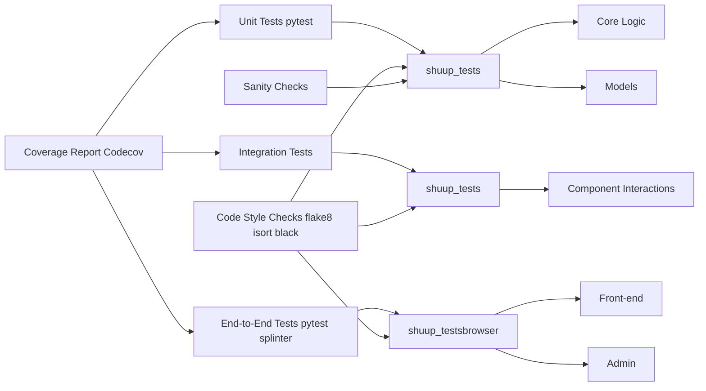

# TDD Analysis of Shuup Shoppe Repository

This analysis assesses the test-driven development (TDD) practices within the provided Shuup Shoppe repository based on the available information (primarily the `.github/workflows` files and `CHANGELOG.md`).  The analysis is limited by the absence of the actual test code and detailed test reports.

## Current Test Coverage and Quality

The repository demonstrates a commitment to testing through its GitHub Actions workflows (`pypi.yml` and `shuup.yml`).  The `shuup.yml` workflow outlines a CI process encompassing:

* **Code Style Checks:**  `flake8`, `isort`, and `black` are used for code style enforcement, indirectly contributing to test maintainability.
* **Sanity and License Checks:** Custom scripts (`_misc/check_sanity.py` and `_misc/ensure_license_headers.py`) perform additional checks, ensuring code quality and adherence to standards.
* **Unit Tests:** `pytest` is used for unit testing, targeting `shuup_tests` with coverage reporting (`--cov shuup`). The `--nomigrations` flag suggests a focus on testing the core application logic separately from database migrations.  Multiple Python versions (`3.6`, `3.7`, `3.8`) are tested, indicating a commitment to cross-version compatibility.
* **Integration/End-to-End Tests:** The `browser` job uses `pytest` with `splinter` for browser-based testing, covering the front-end and admin interfaces.  This indicates a strategy for integration and end-to-end testing.  Headless testing (`--splinter-headless`) is employed for CI efficiency.

The `CHANGELOG.md` shows a history of bug fixes, suggesting that testing has identified and addressed issues. However, without access to the test code and coverage reports, the exact extent and quality of test coverage remain unknown.  The changelog entries frequently mention "Fixed" items, which implies a reactive testing approach rather than a purely proactive TDD approach.

## Test-Driven Development Practices

The evidence suggests a mixture of TDD and a more traditional testing approach. While the extensive CI pipeline indicates a strong emphasis on testing, the changelog entries often describe fixing bugs rather than implementing features through a TDD cycle (red-green-refactor).  A purely TDD approach would show a higher proportion of features implemented with corresponding test cases written *before* the feature code.

## Testing Frameworks and Patterns

The repository utilizes:

* **`pytest`:** A popular and flexible testing framework for Python.
* **`splinter`:** A library for browser automation, enabling integration and end-to-end testing.
* **`flake8`, `isort`, `black`:** Tools for code style enforcement, indirectly improving test readability and maintainability.
* **Codecov:** For code coverage reporting, providing insights into the effectiveness of testing.

The specific testing patterns employed (e.g., mocking, test doubles) are not evident from the provided files.

## Unit, Integration, and End-to-End Testing Strategies

The repository appears to employ a multi-layered testing strategy:

* **Unit Tests:** Focus on individual modules and functions within `shuup_tests`.
* **Integration Tests:**  Likely incorporated within `shuup_tests` and potentially in the browser tests, verifying interactions between different components.
* **End-to-End Tests:** The browser tests (`shuup_tests/browser/front` and `shuup_tests/browser/admin`) simulate user interactions, covering the entire application flow.

## Test Maintainability and Reliability

The use of `pytest`, `flake8`, `isort`, and `black` contributes to test maintainability.  However, the actual maintainability depends on factors not visible in the provided files, such as test code organization, naming conventions, and the use of appropriate mocking techniques.  The reliability of the tests is also dependent on factors such as the robustness of the test cases and the stability of the testing environment.

## Recommendations for Improvement

1. **Enhance TDD Practices:**  Shift towards a more rigorous TDD approach.  For every new feature, write the tests *first*, ensuring that the tests fail before implementing the feature code. This will lead to more robust and reliable code.

2. **Improve Test Coverage:**  Analyze the code coverage reports from Codecov to identify areas with low coverage.  Prioritize writing tests for these under-tested areas.  Strive for high coverage (ideally aiming for 80% or higher) for critical modules.

3. **Document Testing Strategy:** Create a comprehensive document outlining the testing strategy, including the types of tests used, the coverage goals, and the testing process.

4. **Refactor Tests:** Regularly review and refactor the test code to ensure it remains readable, maintainable, and efficient.  Use descriptive test names and organize tests logically.

5. **Implement Continuous Integration/Continuous Delivery (CI/CD):** The existing CI pipeline is a good start.  Extend it to include automated deployment to staging and production environments, further enhancing the reliability and speed of the development process.

6. **Explore Advanced Testing Techniques:** Consider incorporating more advanced testing techniques such as property-based testing (using libraries like Hypothesis) to improve test coverage and find edge cases.

7. **Analyze Test Failures:**  Thoroughly analyze test failures.  Improve the test reporting to provide more detailed information about failures, making debugging easier.

**Mermaid Diagram (Illustrative -  Actual structure needs to be inferred from the codebase):**

This diagram illustrates a potential testing structure. The actual structure and relationships would need to be determined by examining the codebase.  The absence of the test code itself prevents a more precise analysis.