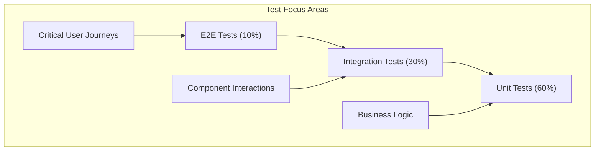

# Test Strategy - shoppe

## Testing Approach
Based on the analysis of your Python project using , here's a comprehensive testing strategy:

## Framework Recommendations

### Python Testing Stack
- **Unit Testing**: pytest (flexible and powerful)
- **Web Testing**: Flask-Testing or FastAPI TestClient
- **E2E Testing**: Selenium with pytest
- **Mocking**: unittest.mock or pytest-mock
- **API Testing**: requests + pytest for API validation

## Testing Pyramid Implementation

### Testing Pyramid Distribution

### Test Type Breakdown
- **Unit Tests (60%)**: Fast, isolated tests for individual functions/components
- **Integration Tests (30%)**: Test component interactions and data flow
- **E2E Tests (10%)**: Test complete user workflows and critical paths

### Current vs Target
- **Current State**: No testing pyramid in place
- **Target State**: Balanced pyramid with comprehensive coverage at all levels

## Test Types and Coverage

### Unit Testing Coverage
- **Target**: 80% of business logic functions
- **Focus**: Service layer methods
- **Priority**: Critical algorithms and data transformations

### Integration Testing Coverage
- **Target**: 60% of component interactions
- **Focus**: Component communication and data flow
- **Priority**: External service integrations

### E2E Testing Coverage
- **Target**: 100% of critical user paths
- **Focus**: Core application workflows
- **Priority**: Authentication, core features, error handling

### API Testing Coverage (if applicable)
- Not applicable - No API layer detected

## Implementation Roadmap

### Phase 1: Foundation (Weeks 1-2)
- [ ] Setup testing framework and configuration
- [ ] Create test directory structure
- [ ] Implement first unit tests for core functions
- [ ] Setup code coverage reporting

### Phase 2: Core Testing (Weeks 3-4)
- [ ] Unit tests for service layer
- [ ] Integration tests for component interactions
- [ ] Mock external dependencies
- [ ] Achieve 40% code coverage

### Phase 3: Integration (Weeks 5-6)
- [ ] Integration tests for component interactions
- [ ] Data layer tests
- [ ] CI/CD pipeline integration
- [ ] Achieve 65% code coverage

### Phase 4: Comprehensive Testing (Weeks 7-8)
- [ ] E2E tests for critical user paths
- [ ] Performance testing setup
- [ ] Test documentation and best practices
- [ ] Achieve 80%+ code coverage target

## Quality Gates

### Quality Gates for Pull Requests
- [ ] **All tests must pass** - No failing tests allowed
- [ ] **Minimum coverage**: New code must have 80% test coverage
- [ ] **No critical issues**: Static analysis must pass
- [ ] **Test review**: Tests must be reviewed for quality and completeness

### Continuous Integration Checks
- [ ] **Automated test execution** on every commit
- [ ] **Coverage reporting** with trend analysis
- [ ] **Performance regression** detection
- [ ] **Security vulnerability** scanning

### Release Quality Gates
- [ ] **Full test suite execution** with 100% pass rate
- [ ] **E2E test validation** for critical paths
- [ ] **Performance benchmarks** within acceptable ranges
- [ ] **Security scan completion** with no critical vulnerabilities

### Monitoring and Alerts
- [ ] **Test execution time** monitoring (target: <5 minutes)
- [ ] **Flaky test detection** and resolution
- [ ] **Coverage trend tracking** with alerts for drops
- [ ] **Test failure notifications** for immediate action

